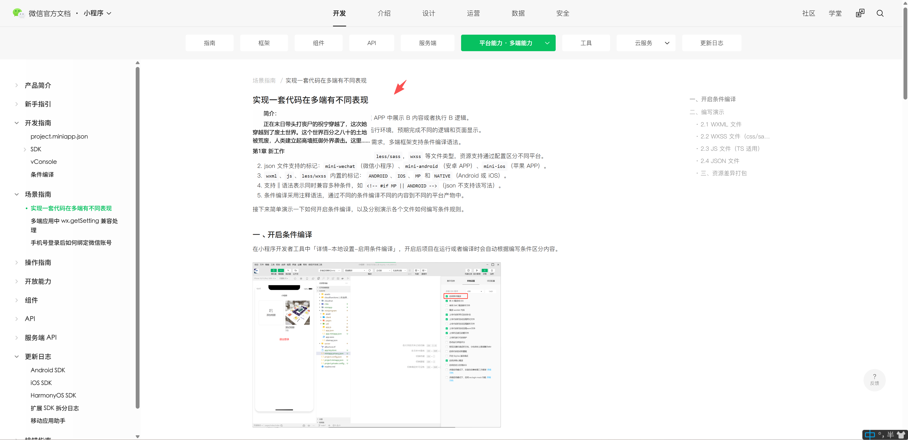

Rish 是一个轻量 Windows 阅读器，支持本地 TXT/EPUB 阅读、透明/置顶/无边框/鼠标移开隐藏窗口显示，并内置在线书城（微信读书与自定义网址）入口。
该软件主要依赖于https://github.com/binbyu/Reader
因为作者很久没更新，摸鱼摸起来体验感有点差，所以用来重新迭代了一下。

## 效果展示

## v3.0.0.6 2026/07/15

1. 默认正文字体调整为五号（10.5pt），字体设置打开时不再默认显示三号。
2. 显示设置新增正文/章节字体颜色取色器，可像背景色一样直接吸取颜色。
3. 优化在线书城的自定义网址、导航恢复和右键删除交互。
4. 加强 EPUB 与配置解析的边界处理，降低异常文件导致崩溃的风险。

## v3.0.0.5 2026/06/23

1. 优化 WebView 顶部操作区，新增网页后退、前进、刷新按钮
2. 调整 WebView 无边框模式下的拖动体验，取消短横线，改为鼠标移入顶部拖动区域时显示拖动光标；
3.  暂时移除网页透明背景能力，不同的网页需要单独处理功能不太好用。仅保留本地阅读场景下的 F2 背景透明

## v3.0.0.4 2026/06/12

1. 优化微信读书启动恢复逻辑。
2. 优化无边框模式下的网页窗口拖动体验。网页顶部新增一条低调的短横线，可按住拖动整个窗口。

## v3.0.0.3 2026/06/05

1. 修复 WebView 场景下 F1 隐藏边框后的显示细节，隐藏边框时网页滚动条也会隐藏，恢复边框后滚动条恢复。
2. 记录上次在线网页状态，关闭软件时如果停留在在线网页，下次启动会恢复到关闭前的网页。
3. 记录在线网页缩放比例，关闭或重新打开后保留上次调整过的网页缩放百分比。

## v3.0.0.2 2026/05/26

1. 新增新建网址功能，可以悄悄当浏览器用了

## v3.0.0.1 2026/05/25

1. 修复微信读书 WebView 内 F1 隐藏/显示边框快捷键失效的问题。
2. 新增隐藏任务栏图标功能，可在设置-显示设置中开启（默认关闭）

## v3.0.0 首次重构 2026/05/22

1. 因为在线书源年久失修，直接砍掉在线功能。
2. 删除“全屏”快捷键，感觉没啥用就删了。
3. 新增背景透明快捷键 F2，看小说的时候更方便。
4. 新增窗口透明度调节。
5. 新增微信读书入口，文件 -> WeRead 即可打开微信读书。微信读书无法支持背景透明和背景修改，只支持隐藏边框。

## 注意

1. 如果需要分享或者推广，请注明软件出处。
2. 本软件严禁用于非法用途。
3. 本软件严禁用于商业用途,如有违反保留追究法律责任的权力。
